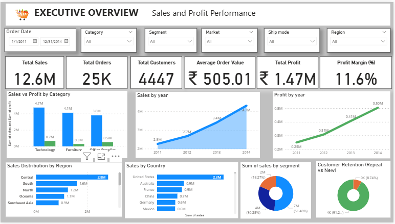
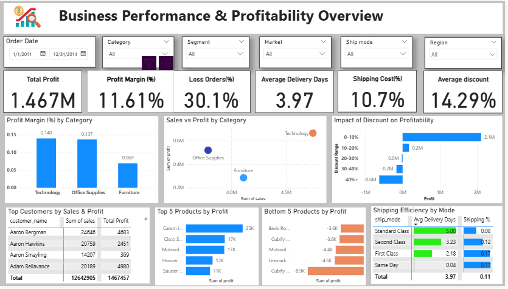

# 🛒 Walmart Sales Analysis | End-to-End Data Analyst Project

## 📌 Objective

Analyze sales, profitability, and customer behavior data to identify key drivers of revenue growth, detect profit leakage, and provide actionable recommendations to improve business performance and operational efficiency.

---
## ❓ Business Questions

- How is the overall business performing in terms of sales and profitability?
- Which categories and products are driving profit vs loss?
- How do discounts impact profitability?
- Are there high-sales but loss-making transactions?
- What are the trends in sales and profit over time?
- Who are the most valuable and repeat customers?
- Which regions contribute most to revenue and profit?
----
## 🧰 Tools & Technologies

* **Python** (Pandas, Matplotlib, Seaborn) → ETL & EDA
* **MySQL** → Business query analysis
* **Power BI** → Interactive dashboard & storytelling

---

## 🔧 ETL Process (Python)

* Data extraction from source dataset
* Data cleaning (missing values, duplicates, formatting)
* Feature engineering:

  * Profit Margin = Profit / Sales
  * Delivery Days = Ship Date - Order Date
  * Time-based features (Year, Month)
* Prepared dataset for analysis and visualization

---

## 📊 Exploratory Data Analysis (Python)

### 🔥 1. Profitability & Discount Analysis

* Category-wise sales and profit comparison
* Profit margin analysis
* Discount vs Profit relationship
* Discount bucketing to identify loss thresholds

👉 **Key Finding:** High discounts significantly reduce profitability, especially beyond certain thresholds.

---

### 📈 2. Sales vs Profit Relationship

* Scatter analysis of sales vs profit

👉 **Insight:** High revenue does not always translate to profit due to discounting and cost factors.

---

### 📅 3. Time Trend Analysis

* Year-wise sales and profit trends

👉 **Insight:** Sales show steady growth, but profit growth requires monitoring.

---

### 👥 4. Customer Behavior

* Orders per customer
* Repeat vs new customers

👉 **Insight:** Repeat customers contribute the majority of revenue.

---

### ⚠️ 5. Loss Analysis

* Percentage of loss-making orders
* Category-level loss contribution

👉 **Insight:** A significant portion of orders are loss-making due to pricing inefficiencies.

---

### 🌍 6. Supporting Analysis

* Region-wise performance
* Product-level performance (Top & Bottom)

---

## 🗄 SQL Analysis (MySQL)

### Key Business Questions Answered:

* Overall business performance (Sales, Profit, Margin)
* Category & sub-category profitability
* Loss-making orders and categories
* Discount impact on profit
* Sales and profit trends over time
* Top customers and repeat customer behavior
* Regional performance
* Identification of high-loss products

👉 **Advanced SQL Concepts Used:**

* Aggregations (SUM, AVG, COUNT)
* CASE statements (discount bucketing)
* Subqueries (repeat customer detection)
* Grouping & filtering for business insights

---

## 📊 Power BI Dashboard

### 🔹 Page 1: Executive Overview

* KPIs: Sales, Orders, Customers, Profit, Margin
* Sales & Profit trends over time
* Category, region, and segment performance
* Customer retention insights

👉 **Purpose:** High-level business performance snapshot


---
### 🔹 Page 2: Profitability & Operations

* Profit margin by category
* Discount impact on profitability
* Loss orders percentage
* Top & bottom products
* Shipping efficiency analysis

👉 **Purpose:** Identify profit leakage and operational inefficiencies


---

## 🔍 Key Insights

- Discounts above ~30% consistently lead to negative profit margins  
- Furniture category generates high revenue but operates at low profitability  
- High-value orders can still be loss-making due to aggressive discounting  
- Profit growth is not aligned with sales growth, indicating cost inefficiencies  
- Repeat customers contribute a significant share of total revenue  
- A notable percentage of total orders are loss-making  
- Specific products consistently generate losses, indicating pricing issues   

---

## 💡 Recommendations

* Reduce excessive discounting, especially in loss-making categories
* Focus on high-margin products (e.g., Technology)
* Optimize pricing strategies to improve profitability
* Strengthen customer retention strategies
* Monitor and address loss-making products
* Improve operational efficiency in shipping and delivery

---

## 📁 Project Structure

```
walmart-sales-analysis/
│
├── data/
├── notebooks/
│   ├── 01_etl.ipynb
│   ├── 02_eda.ipynb
├── sql/
│   └── analysis.sql
├── dashboard/
│   └── walmart_dashboard.pbix
├── images/
│   └── dashboard_preview.png
└── README.md
```
---- 
## 📈 Business Impact

- Identified key profit leakage areas driven by high discounting  
- Highlighted loss-making products contributing to revenue inefficiency  
- Enabled data-driven decision-making for pricing and discount strategies  
- Provided insights to improve customer retention and profitability   
---

## 🚀 Conclusion

This project demonstrates an end-to-end data analysis workflow—from data preparation and exploration to business-driven insights and interactive dashboards—focused on improving profitability and operational efficiency.

---

## 📌 Future Improvements

* Build predictive model for profit optimization
* Customer segmentation using clustering
* Advanced cohort analysis for retention

---
